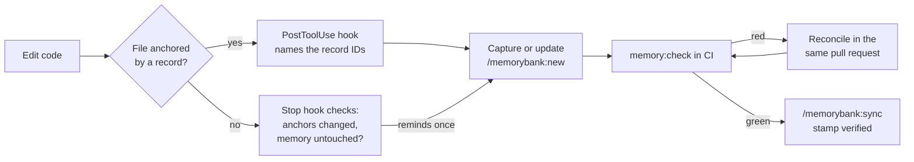
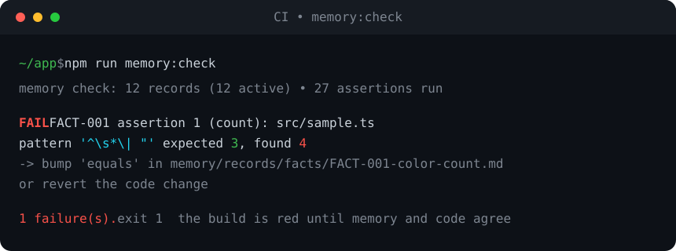

<p align="center">
  
</p>

<p align="center">
  
  
  
  
  
</p>

<p align="center">
  <b>memorybank</b> gives any repository a structured memory system that an AI agent cannot quietly let rot.<br>
  Decisions, conventions, volatile facts, feature invariants, and intentionally-deferred work become<br>
  one-file-per-record markdown carrying <b>machine-verifiable assertions</b> that fail CI when memory and code diverge.
</p>

<p align="center">
  
</p>

<p align="center">
  <a href="#setup">Initial setup</a> &#160;&#183;&#160;
  <a href="#model">The model</a> &#160;&#183;&#160;
  <a href="#hooks">Hook recommendations</a> &#160;&#183;&#160;
  <a href="#commands">Commands</a> &#160;&#183;&#160;
  <a href="#tips">Tips</a>
</p>

---

## Why this exists

Plain markdown memory (CLAUDE.md and friends) drifts. Counts go stale, recipes reference removed APIs,
and deliberate gaps get "fixed" by a well-meaning agent on the next pass. memorybank makes every memory
claim either **asserted** (checked against the code in CI) or **explicitly marked unverifiable**, and keeps
the rationale, the WHY, one `Read` away from the code it governs. A legitimate change that breaks an assertion
turns CI red and names the record to update. That friction is the point: memory and code can only move together.

<br>

<a id="setup"></a>

##  &nbsp;Initial setup

### Requirements

| Requirement | Why |
|---|---|
| [Claude Code](https://docs.claude.com/en/docs/claude-code) | host for the plugin |
| Node.js 18+ with `npx`/`tsx` | runs the zero-dependency checker (`memory.ts`) |
| A git repository | assertions and staleness use `git ls-files` and `git diff` |
| `jq` (recommended) | enables the edit-time and stop hooks |
| Network / Context7 MCP (optional) | live best-practice seeding at init — degrades gracefully offline |

### 1. Install the plugin

```bash
claude plugin marketplace add thisisforeagle/memory-bank
claude plugin install memorybank@091solutions
```

Verify it registered:

```bash
claude plugin list        # memorybank@091solutions  -  enabled
```

### 2. Adopt it in a repository

Inside the target repo, run the init skill from Claude Code:

```
/memorybank:init
```

This is a one-time setup. It starts with a **feature menu** — you choose what to enable (best-practice
seeding, testing setup, caveman record style, CI wiring); core scaffolding is always done. Then it:

1. Scaffolds `memory/records/{decisions,conventions,facts,features,deferred}/` (plus `memory/STYLE.md`
   if you chose the caveman style).
2. **Vendors the checker** into `memory/memory.ts` so CI never depends on the plugin being installed.
3. Adds `memory:check`, `memory:index`, `memory:stale`, and `memory:sync` package scripts.
4. **Seeds 5–12 stack-specific starter records** (if enabled): detects your stack from manifests, fetches
   current best practices live (Context7/web, degrades gracefully offline), and proposes bug-prevention
   rules, feature-building patterns, deferred items, and testing conventions — for your confirmation
   before anything is written.
5. **Offers guided test-framework setup** (if enabled): when your stack lacks one (e.g. a web app with no
   e2e), it asks before adding Playwright with a minimal config and one example spec — no suite generation.
6. Generates `memory/INDEX.md` and `@`-imports it from `CLAUDE.md`.
7. Wires a `memory:check` step into your CI workflow (if enabled).

### 3. Capture your first records

Init pre-seeds stack-level records; use `/memorybank:new` for everything project-specific it couldn't infer.
Good starter candidates: locked architecture decisions, "intentionally not done" items, and every volatile
count currently hardcoded in prose.

```
/memorybank:new fact "Color union has 3 members"
```

<br>

<a id="model"></a>

##  &nbsp;The model

Every record is one file with rigid YAML frontmatter plus a body. The frontmatter is machine-checked;
the body holds the `## Why` that stops future re-litigation.

```text
memory/
├─ INDEX.md                         generated digest, @-imported from CLAUDE.md
├─ README.md
├─ STYLE.md                         caveman style guide (present when enabled at init)
└─ records/
   ├─ decisions/DEC-001-*.md        locked choices and rejected alternatives
   ├─ conventions/CONV-001-*.md     rules agents must follow
   ├─ facts/FACT-001-*.md           volatile values, asserted not hardcoded in prose
   ├─ features/FEAT-001-*.md        shipped behaviour and invariants
   └─ deferred/DEF-001-*.md         intentionally NOT done, do not "fix"
```

### Assertion language

This is the whole specification. Patterns are JavaScript regexes (`m` flag; `count` adds `g`).

| Type | Fields | Passes when |
|---|---|---|
| `file-exists` | `path` | the path exists |
| `symbol-exists` | `path`, `pattern` | the regex matches in the file (the anchor is still present) |
| `count` | `path`, `pattern`, `equals` | the match count equals N |
| `forbidden` | `glob`, `pattern`, `allow?` | zero matches across tracked and untracked files in the glob |
| `command` | `run`, `timeout?` | the shell command exits 0 (delegate to an existing repo check) |
| `none` | `reason` | always, an explicitly unverifiable record kept honest in coverage stats |

`forbidden` globs are git pathspecs: write `:(glob)src/**/*.ts` for true `**` semantics — a bare
`src/**/*.ts` silently skips files directly in `src/`, and a glob that matches nothing passes vacuously.

A real `fact` record, end to end:

```yaml
---
id: FACT-001
title: Color union size
kind: fact
status: active
rule: "Color in src/sample.ts has 3 members; never hardcode this count in prose."
anchors:
  - path: src/sample.ts
    symbol: 'export type Color'
assertions:
  - type: count
    path: src/sample.ts
    pattern: '^\s*\| "'
    equals: 3
created: 2026-06-12
---

## Why
The member count drifts when restated in prose. This record is the single place it is asserted.
```

### Caveman compression

Records and `INDEX.md` load into every agent session, so every token costs. When enabled at init, record
prose follows `memory/STYLE.md` (shipped from the plugin's [`templates/style.md`](templates/style.md)):
terse imperative fragments, no filler, token budgets for `rule:` lines and `## Why` bodies — and **never**
compress load-bearing tokens like paths, symbols, regexes, or record IDs. Since each `INDEX.md` row is the
record's `rule:` line verbatim, trimming rules at the source keeps the session digest lean automatically.

<br>

<a id="hooks"></a>

##  &nbsp;Hook recommendations

The plugin ships three hooks that register automatically on install. **None of them block your work** and
all are **silent in repositories without a `memory/` directory**, so the recommendation is simple: leave them
enabled. Each degrades gracefully when an optional tool is missing.

| Hook | Fires on | What it does | Needs |
|---|---|---|---|
| **SessionStart** | new session | Adds a status line: record count, stale records, last sync. Full digest still arrives via `@memory/INDEX.md`. | `node`, `npx tsx` (falls back to a bare count) |
| **PostToolUse** | `Edit` / `Write` / `MultiEdit` | If the edited file is anchored by records, surfaces their IDs and rules so you reconcile before drifting. Pure bash/awk, no per-edit startup cost. | `jq`, `node` |
| **Stop** | end of turn | Once per session: if anchored files changed but nothing under `memory/` did, reminds you to capture the decision or consciously skip. | `jq`, `node` |

What the edit-time nudge looks like in practice:

```text
┌───────────────────────────────────────────────────────────────┐
│ MEMORY ANCHOR NUDGE                                             │
│ File: src/sample.ts is anchored by 1 memory record(s):         │
│   FACT-001: Color in src/sample.ts has 3 members; never        │
│   hardcode this count in prose.                                 │
│ If your change alters recorded behaviour, update the record    │
│ or run /memorybank:review. Counts will fail memory:check.      │
└───────────────────────────────────────────────────────────────┘
```

**Recommendations**

- **Install `jq` and make `npx tsx` resolvable.** Two of the three hooks need `jq`, and the staleness line
  needs `tsx`. Without them the hooks stay silent rather than erroring, so you simply lose signal.
- **Treat hooks as advisory, CI as the gate.** The hooks remind a human or agent in the moment; the real
  enforcement is `memory:check` in CI. Keep both.
- **Ignore the debounce state file.** The Stop hook records one nudge per session in
  `.claude/.memory-stop-nudge`. Add it to `.gitignore`.
- **Disable selectively, not globally.** If one hook is noisy in a specific repo, turn off that single hook
  in your settings rather than disabling the plugin and losing the others.

<br>

<a id="commands"></a>

##  &nbsp;Commands

| Command | Use it to |
|---|---|
| `/memorybank:init` | Adopt memorybank in a repo: pick features, scaffold, vendor the checker, seed stack best practices + testing, wire CI. Run once. |
| `/memorybank:new` | Capture a decision, convention, fact, feature, or deferred item at the moment it happens. |
| `/memorybank:check` | Run the drift checker and explain any failure (which side drifted, how to reconcile). |
| `/memorybank:review` | Full audit: hard failures plus semantic-drift candidates, with proposed record updates. |
| `/memorybank:sync` | After a green check, regenerate `INDEX.md` and stamp `verified` on every active record (blanket stamp, `--all`). |

Under the hood each command drives the vendored `memory.ts` checker, which you can also call directly:

```bash
npm run memory:check                # verify everything, exit 1 on drift  (the CI gate)
npm run memory:index                # regenerate memory/INDEX.md
npm run memory:stale                # records whose anchors moved since last verified sha
npm run memory:sync -- --all        # green check, then stamp verified on all records
npm run memory:sync -- --only <id>  # same check, but stamp that one record only
```

<br>

##  &nbsp;The maintenance loop



A legitimate code change that breaks a `count` assertion fails CI. The failure message names the record and
the fix direction. You bump it in the same pull request. There is no bypass path, and that is the design.

<br>

<a id="tips"></a>

##  &nbsp;Tips for usage

- **Capture at the moment of decision.** The cheapest time to write a record is right after you make the call.
  The Stop hook reminds you once per session, but do not rely on it as the primary trigger.
- **Prefer a verifiable assertion over `none`.** Reach for `count`, `symbol-exists`, `forbidden`, or `command`
  first. Use `type: none` only for genuinely unverifiable process rules, and always give a `reason`.
- **Move volatile counts out of prose.** Anything numeric that appears in documentation belongs in a `fact`
  record with a `count` assertion. Have the prose reference the record ID instead of restating the number.
- **Check what governs a file before you edit it:** `npx tsx memory/memory.ts anchors --match src/sample.ts`
  lists the records anchored to it.
- **Never bypass a red `memory:check`.** Red means memory and code disagree. Reconcile by bumping the record
  for a legitimate change, or by fixing the code for a violation. Both directions are correct; skipping is not.
- **Review weekly-ish.** `/memorybank:review` catches semantic drift: records whose assertions still pass but
  whose anchored code moved. Finish with `/memorybank:sync` to re-stamp.
- **Retiring a record is a decision.** Do not delete records silently. Set `status: superseded` with a
  `superseded-by` pointer (or `retired`) and explain why in the body.
- **Keep `INDEX.md` committed.** CI gates its freshness, so regenerate and commit it alongside record changes.

What a caught drift looks like in CI:

<p align="center">
  
</p>

<br>

## What's new in 0.3.0

- **`memory:stale` is three-state.** Records whose `verified.sha` cannot be resolved in a shallow clone (the CI
  default) are reported as **unknown**, excluded from the stale count, and get one hint to `git fetch --unshallow`.
  In a complete clone an unresolvable sha is still loud STALE — it means the commit was rebased away or fabricated.
- **`memory:stale --json`** emits `{ active, staleCount, unknownCount, shallow, lastSync, stale, unknown }`, so CI
  can gate on real staleness while ignoring unknown.
- **`memory:sync` is scoped.** `--only <id>` now stamps exactly that record (it used to be silently ignored and
  everything got re-stamped); an unknown id exits non-zero and writes nothing.
- **Blanket stamping needs `--all`** (breaking). Bare `npm run memory:sync` refuses with a non-zero exit and tells
  you which flag to pass. The full check still runs before any stamp is written.

<br>

## Self-test and development

The checker ships with golden fixtures that double as living documentation of the record format:

```bash
scripts/selftest.sh           # fixtures/pass must be green, fixtures/fail must fail
```

To validate a record set by hand from anywhere:

```bash
npx tsx scripts/memory.ts check --root fixtures/pass
```

<br>

---

<p align="center">
  <sub>Built by <b>091 Solutions</b> &#160;&#183;&#160; a Claude Code plugin &#160;&#183;&#160; <code>memorybank@091solutions</code></sub>
</p>
